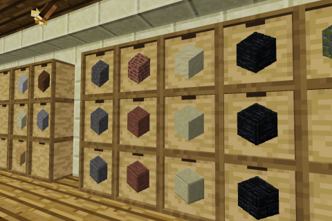

# Luanti Mod Storage Drawers

[](https://content.minetest.net/packages/LNJ/drawers/)




## Description
This mod adds simple item storages showing the item's inventory image in the
front. By left- or right-clicking the image you can take or add stacks. If you
also hold the shift-key only a single item will be removed/added.

There's also a 'Drawer Controller' which can insert items automatically into a
network of drawers. Just place the drawers next to each other, so they are
connected and the drawer controller will sort the items automatically. If you
want to connect drawers, but you don't want to place another drawer, just use
the 'Drawer Trim'.

Do you have too many cobblestones for one drawer? No problem, just add some
drawer upgrades to your drawer! They are available in different sizes and are
crafted by steel, gold, obsidian, diamonds or mithril.

## Digilines
The drawer controller is digilines-compatible. To request an item from the
surrounding drawers, send an itemstring to its channel:
* `"default:dirt 15"`
* `"default:cobble"`

The items will be sent out the back of the drawer controller.

To request the contents of a drawer network, send a table with the following
format:

1. `command` (string) - `"get"`
2. `offset` (integer) - Used to paginate the results if the amount of drawers in
	the network exceeds `drawers.controller_max_matches`. Defaults to 1.
3. `max_count` (integer) - Must be between 1 and `drawers.controller_max_matches`.
	Defaults to `drawers.controller_max_matches`. Maximum amount of drawers to return.

Example response:
```lua
{
	drawers = {
		{
			position = {x = 0, y = 10, z = 0},
			slots = {
				{name = "default:stick", count = 321, max = 10000},
				-- Next slot (if available, up to 4)
			}
		},
		-- Next drawer (limited by max_count)
	},
	offset = 4,  -- Requested offset
	total = 12  -- Total amount of drawers in the network
}
```

## Features
* 1x1, 1x2 and 2x2 tiled drawers
* Content (item) type locking
* Drawer Controller to automatically insert items into a network of drawers
* `digilines` support ([API reference](docs/digiline.md))
* `pipeworks` support
* `techage` support

## Dependencies
* Luanti >= 5.12.0 (for best experience)
* Supported games: Minetest Game (or compatible), VoxeLands/Mineclonia
    * For craft recipes

## License
* Source code: MIT
* Media: CC BY 3.0 / MIT

See also: [LICENSE.txt](LICENSE.txt)

## To-Do
- [ ] Add half-sized drawers
- [ ] Add compacting drawers for auto-crafting blocks/ingots/fragments
- [ ] Add duct tape to transport drawers
- [ ] Support hoppers (needs hoppers mod change)
- [x] Make drawers upgradable

## Bug reports and suggestions
You can report bugs and suggest ideas on [GitHub](https://github.com/minetest-mods/drawers/issues/new),
alternatively you can also [email](mailto:git@lnj.li) me.

## Credits
#### Thanks to:
* Justin Aquadro ([@jaquadro](http://github.com/jaquadro)), developer of the
	original Minecraft Mod (also licensed under MIT :smiley:) — Textures and Ideas
* Mango Tango <<mtango688@gmail.com>> ([@mtango688](http://github.com/mtango688)),
	creator of the Minetest Mod ["Caches"](https://github.com/mtango688/caches/)
	— I reused some code by you. :)

## Links
* [Luanti Forums](https://forum.luanti.org/viewtopic.php?f=9&t=17134)
* [GitHub](http://github.com/minetest-mods/drawers/)
* [ContentDB](https://content.luanti.org/packages/LNJ/drawers/)
